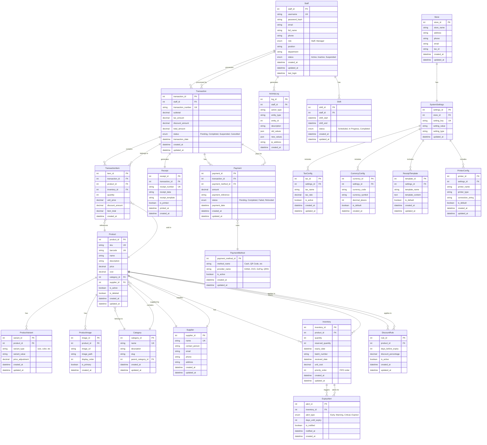

# POS System Entity Relationship Diagram (ERD)



## PlantUML Entity Relationship Diagram

```plantuml
@startuml POS_System_ERD
!define PK(x) <b><color:red>PK</color></b> x
!define FK(x) <color:blue>FK</color> x
!define UK(x) <color:green>UK</color> x

entity "Staff" as staff {
  PK(staff_id) : INTEGER
  UK(username) : VARCHAR(50)
  * password_hash : VARCHAR(255)
  * email : VARCHAR(100)
  * full_name : VARCHAR(100)
  * phone : VARCHAR(20)
  * role : ENUM(Staff, Manager)
  * position : VARCHAR(50)
  * department : VARCHAR(50)
  * status : ENUM(Active, Inactive, Suspended)
  * created_at : DATETIME
  * updated_at : DATETIME
  * last_login : DATETIME
}

entity "Category" as category {
  PK(category_id) : INTEGER
  UK(name) : VARCHAR(100)
  * description : TEXT
  * slug : VARCHAR(100)
  FK(parent_category_id) : INTEGER
  * created_at : DATETIME
  * updated_at : DATETIME
}

entity "Supplier" as supplier {
  PK(supplier_id) : INTEGER
  UK(name) : VARCHAR(100)
  * contact_person : VARCHAR(100)
  * email : VARCHAR(100)
  * phone : VARCHAR(20)
  * address : TEXT
  * created_at : DATETIME
  * updated_at : DATETIME
}

entity "Product" as product {
  PK(product_id) : INTEGER
  UK(sku) : VARCHAR(50)
  UK(barcode) : VARCHAR(50)
  * name : VARCHAR(200)
  * description : TEXT
  * price : DECIMAL(10,2)
  * cost : DECIMAL(10,2)
  FK(category_id) : INTEGER
  FK(supplier_id) : INTEGER
  * is_active : BOOLEAN
  * is_deleted : BOOLEAN
  * created_at : DATETIME
  * updated_at : DATETIME
}

entity "ProductVariant" as product_variant {
  PK(variant_id) : INTEGER
  FK(product_id) : INTEGER
  * variant_type : VARCHAR(50)
  * variant_value : VARCHAR(100)
  * price_adjustment : DECIMAL(10,2)
  * created_at : DATETIME
  * updated_at : DATETIME
}

entity "ProductImage" as product_image {
  PK(image_id) : INTEGER
  FK(product_id) : INTEGER
  * image_url : VARCHAR(500)
  * image_path : VARCHAR(500)
  * display_order : INTEGER
  * is_primary : BOOLEAN
  * created_at : DATETIME
}

entity "Inventory" as inventory {
  PK(inventory_id) : INTEGER
  FK(product_id) : INTEGER
  * quantity : INTEGER
  * reserved_quantity : INTEGER
  * expiry_date : DATE
  * batch_number : VARCHAR(50)
  * received_date : DATE
  * unit_cost : DECIMAL(10,2)
  * priority_order : INTEGER
  * created_at : DATETIME
  * updated_at : DATETIME
}

entity "Transaction" as transaction {
  PK(transaction_id) : INTEGER
  FK(staff_id) : INTEGER
  UK(transaction_number) : VARCHAR(50)
  * subtotal : DECIMAL(10,2)
  * tax_amount : DECIMAL(10,2)
  * discount_amount : DECIMAL(10,2)
  * total_amount : DECIMAL(10,2)
  * status : ENUM(Pending, Completed, Suspended, Cancelled)
  * transaction_date : DATETIME
  * created_at : DATETIME
  * updated_at : DATETIME
}

entity "TransactionItem" as transaction_item {
  PK(item_id) : INTEGER
  FK(transaction_id) : INTEGER
  FK(product_id) : INTEGER
  FK(inventory_id) : INTEGER
  * quantity : INTEGER
  * unit_price : DECIMAL(10,2)
  * discount_amount : DECIMAL(10,2)
  * item_total : DECIMAL(10,2)
  * created_at : DATETIME
}

entity "Payment" as payment {
  PK(payment_id) : INTEGER
  FK(transaction_id) : INTEGER
  FK(payment_method_id) : INTEGER
  * amount : DECIMAL(10,2)
  * payment_reference : VARCHAR(100)
  * status : ENUM(Pending, Completed, Failed, Refunded)
  * payment_date : DATETIME
  * created_at : DATETIME
  * updated_at : DATETIME
}

entity "PaymentMethod" as payment_method {
  PK(payment_method_id) : INTEGER
  * method_name : VARCHAR(50)
  * provider_name : VARCHAR(50)
  * is_active : BOOLEAN
  * created_at : DATETIME
  * updated_at : DATETIME
}

entity "Receipt" as receipt {
  PK(receipt_id) : INTEGER
  FK(transaction_id) : INTEGER
  UK(receipt_number) : VARCHAR(50)
  * receipt_data : TEXT
  * receipt_template : VARCHAR(100)
  * is_printed : BOOLEAN
  * printed_at : DATETIME
  * created_at : DATETIME
}

entity "DiscountRule" as discount_rule {
  PK(rule_id) : INTEGER
  FK(product_id) : INTEGER
  * days_before_expiry : INTEGER
  * discount_percentage : DECIMAL(5,2)
  * is_active : BOOLEAN
  * created_at : DATETIME
  * updated_at : DATETIME
}

entity "ExpiryAlert" as expiry_alert {
  PK(alert_id) : INTEGER
  FK(inventory_id) : INTEGER
  * alert_type : ENUM(Early, Warning, Critical, Expired)
  * days_until_expiry : INTEGER
  * is_notified : BOOLEAN
  * notified_at : DATETIME
  * created_at : DATETIME
}

entity "ActivityLog" as activity_log {
  PK(log_id) : INTEGER
  FK(staff_id) : INTEGER
  * action_type : VARCHAR(50)
  * entity_type : VARCHAR(50)
  * entity_id : INTEGER
  * description : TEXT
  * old_values : JSON
  * new_values : JSON
  * ip_address : VARCHAR(45)
  * created_at : DATETIME
}

entity "Shift" as shift {
  PK(shift_id) : INTEGER
  FK(staff_id) : INTEGER
  * shift_start : DATETIME
  * shift_end : DATETIME
  * status : ENUM(Scheduled, In Progress, Completed)
  * created_at : DATETIME
  * updated_at : DATETIME
}

entity "Store" as store {
  PK(store_id) : INTEGER
  * store_name : VARCHAR(100)
  * address : TEXT
  * phone : VARCHAR(20)
  * email : VARCHAR(100)
  * tax_id : VARCHAR(50)
  * created_at : DATETIME
  * updated_at : DATETIME
}

entity "SystemSettings" as system_settings {
  PK(settings_id) : INTEGER
  FK(store_id) : INTEGER
  UK(setting_key) : VARCHAR(100)
  * setting_value : TEXT
  * setting_type : VARCHAR(50)
  * updated_at : DATETIME
}

entity "TaxConfig" as tax_config {
  PK(tax_id) : INTEGER
  FK(settings_id) : INTEGER
  * tax_name : VARCHAR(100)
  * tax_rate : DECIMAL(5,2)
  * is_active : BOOLEAN
  * created_at : DATETIME
  * updated_at : DATETIME
}

entity "CurrencyConfig" as currency_config {
  PK(currency_id) : INTEGER
  FK(settings_id) : INTEGER
  * currency_code : VARCHAR(3)
  * currency_symbol : VARCHAR(10)
  * decimal_places : INTEGER
  * is_default : BOOLEAN
  * created_at : DATETIME
}

entity "ReceiptTemplate" as receipt_template {
  PK(template_id) : INTEGER
  FK(settings_id) : INTEGER
  * template_name : VARCHAR(100)
  * template_content : TEXT
  * is_default : BOOLEAN
  * created_at : DATETIME
  * updated_at : DATETIME
}

entity "PrinterConfig" as printer_config {
  PK(printer_id) : INTEGER
  FK(settings_id) : INTEGER
  * printer_name : VARCHAR(100)
  * printer_type : VARCHAR(50)
  * connection_string : VARCHAR(200)
  * is_default : BOOLEAN
  * created_at : DATETIME
  * updated_at : DATETIME
}

' Relationships
staff ||--o{ transaction : "processes"
staff ||--o{ activity_log : "generates"
staff ||--o{ shift : "has"

category ||--o{ product : "contains"
category ||--o{ category : "parent"

supplier ||--o{ product : "supplies"

product ||--o{ product_variant : "has"
product ||--o{ product_image : "has"
product }o--|| category : "belongs to"
product }o--|| supplier : "supplied by"
product ||--o{ inventory : "has"
product ||--o{ transaction_item : "sold in"
product ||--o{ discount_rule : "applies to"

inventory ||--o{ expiry_alert : "triggers"
inventory ||--o{ transaction_item : "used in"

transaction ||--o{ transaction_item : "contains"
transaction ||--|| receipt : "generates"
transaction ||--o{ payment : "has"
transaction }o--|| staff : "processed by"

payment }o--|| payment_method : "uses"

discount_rule }o--|| product : "applies to"

expiry_alert }o--|| inventory : "alerts for"

store ||--|| system_settings : "has"

system_settings ||--o{ tax_config : "includes"
system_settings ||--o{ currency_config : "includes"
system_settings ||--o{ receipt_template : "includes"
system_settings ||--o{ printer_config : "includes"

@enduml
```



### How to Use PlantUML

1. **Online Editor**: Visit [PlantUML Online Server](http://www.plantuml.com/plantuml/uml/) and paste the code above
2. **VS Code Extension**: Install the "PlantUML" extension and preview the diagram
3. **IntelliJ IDEA**: Install PlantUML plugin and create a `.puml` file
4. **Command Line**: Use PlantUML jar file to generate images
5. **Export Formats**: PNG, SVG, PDF, EPS

### PlantUML Syntax Notes

- `PK(x)` - Primary Key (red, bold)
- `FK(x)` - Foreign Key (blue)
- `UK(x)` - Unique Key (green)
- `||--o{` - One-to-Many relationship
- `}o--||` - Many-to-One relationship
- `||--||` - One-to-One relationship

## Entity Descriptions

### Core Entities

#### Staff
Represents staff members (Manager and Staff roles) who use the POS system. Tracks authentication, roles, and personal information.

#### Product
Main product entity containing product information including SKU, barcode, name, price, cost, and relationships to category and supplier.

#### Category
Product categorization system supporting hierarchical categories (parent-child relationships).

#### Supplier
Supplier information for products including contact details.

#### Inventory
Stock tracking with expiry date management, batch numbers, and FIFO priority ordering. Tracks quantity and reserved quantity.

### Transaction Entities

#### Transaction
Sales transaction record containing transaction details, totals, tax, discounts, and status (Pending, Completed, Suspended, Cancelled).

#### TransactionItem
Individual items within a transaction, linking products to transactions with quantity, pricing, and discounts.

#### Payment
Payment records for transactions, supporting multiple payment methods per transaction (split payments).

#### PaymentMethod
Payment method configuration (Cash, QR Code providers like DANA, OVO, GoPay, QRIS).

#### Receipt
Receipt generation and tracking, including print status and template information.

### Product Enhancement Entities

#### ProductVariant
Product variants such as size, color, etc., with optional price adjustments.

#### ProductImage
Product images with display ordering and primary image designation.

### Expiry Management Entities

#### DiscountRule
Automatic discount rules based on days until expiry (e.g., 10% off when 3 days left, 20% off when 1 day left).

#### ExpiryAlert
Alert system for expiring products with different alert types (Early, Warning, Critical, Expired) and notification tracking.

### System Management Entities

#### ActivityLog
Audit trail for staff actions, tracking all changes with old and new values for compliance and security.

#### Shift
Staff shift scheduling and tracking for attendance management.

#### SystemSettings
System-wide configuration settings stored as key-value pairs.

#### Store
Store information including name, address, contact details, and tax ID.

#### TaxConfig
Tax rate configuration for different tax types.

#### CurrencyConfig
Currency settings including code, symbol, and decimal places.

#### ReceiptTemplate
Receipt template customization for different receipt formats.

#### PrinterConfig
Printer configuration for thermal printers and other printing devices.

## Key Relationships

1. **Staff → Transaction**: One staff member can process many transactions
2. **Product → Inventory**: One product can have multiple inventory batches (for FIFO tracking)
3. **Transaction → TransactionItem**: One transaction contains many items
4. **Transaction → Payment**: One transaction can have multiple payments (split payment)
5. **Product → DiscountRule**: Products can have automatic discount rules based on expiry
6. **Inventory → ExpiryAlert**: Inventory batches trigger expiry alerts
7. **Staff → ActivityLog**: All staff actions are logged for audit purposes
8. **Product → Category**: Products belong to categories (many-to-one)
9. **Product → Supplier**: Products are supplied by suppliers (many-to-one)

## Design Notes

- **FIFO Implementation**: The `Inventory` table includes `priority_order` and `expiry_date` to support FIFO stock rotation
- **Soft Delete**: Products use `is_deleted` flag for soft deletion
- **Split Payments**: Multiple `Payment` records can belong to one `Transaction`
- **Batch Tracking**: `Inventory` tracks batches with `batch_number` and `expiry_date` for expiry management
- **Audit Trail**: `ActivityLog` stores JSON for old/new values to track all changes
- **Suspended Transactions**: Transaction status includes "Suspended" for hold/retrieve functionality
- **Expiry Alerts**: `ExpiryAlert` tracks notification status to prevent duplicate alerts

---

## Draw.io Import Format

### How to Import into Draw.io

1. Open [draw.io](https://app.diagrams.net/) or [diagrams.net](https://www.diagrams.net/)
2. Go to **File → Import from → Device** (or use Ctrl+Shift+O)
3. Select the CSV file format
4. Copy the CSV data below and save it as a `.csv` file, then import it
5. Or use **Arrange → Insert → Advanced → CSV** and paste the CSV data directly

### CSV Format for Draw.io Import

Copy the entire block below (including configuration) and paste it into draw.io using **Arrange → Insert → Advanced → CSV**:

```csv
##
## POS System Entity Relationship Diagram CSV Import for Draw.io
## Use ## for comments and # for configuration
##
#
# Node label with entity name and description
#
# label: <b>%name%</b><br><i style="color:#666;">%description%</i>
#
# Node style for database entities
#
# style: shape=table;startSize=30;container=1;collapsible=0;recursiveResize=1;whiteSpace=wrap;html=1;fillColor=%fill%;strokeColor=%stroke%;rounded=1;
#
# Parent style
#
# parentstyle: shape=table;startSize=30;container=1;collapsible=0;recursiveResize=1;whiteSpace=wrap;html=1;
#
# Unknown style
#
# unknownStyle: -
#
# Identity column
#
# identity: id
#
# Parent reference
#
# parent: parent
#
# Namespace
#
# namespace: erd-
#
# Connections between entities
#
# connect: {"from": "parent", "to": "id", "style": "endArrow=ERmany;startArrow=ERone;rounded=0;html=1;", "label": "%relationship%"}
#
# Width
#
# width: auto
#
# Height
#
# height: auto
#
# Collapsed
#
# collapsed: false
#
# Padding
#
# padding: 0
#
# Ignored columns
#
# ignore: id,fill,stroke
#
# Layout
#
# layout: auto
#
## ---- CSV below this line. First line are column names. ----
id,name,description,fill,stroke,parent,relationship
staff,Staff,Staff members with roles (Manager/Staff),#dae8fc,#6c8ebf,,
category,Category,Product categories with hierarchy,#d5e8d4,#82b366,,
supplier,Supplier,Product suppliers,#fff2cc,#d6b656,,
product,Product,Main product entity,#f8cecc,#b85450,category,belongs to
product,Product,Main product entity,#f8cecc,#b85450,supplier,supplied by
product_variant,ProductVariant,Product variants (size color etc),#e1d5e7,#9673a6,product,has
product_image,ProductImage,Product images,#e1d5e7,#9673a6,product,has
inventory,Inventory,Stock with expiry and FIFO tracking,#e1d5e7,#9673a6,product,has
discount_rule,DiscountRule,Auto discount rules for expiry,#e1d5e7,#9673a6,product,applies to
transaction_item,TransactionItem,Items in transactions,#e1d5e7,#9673a6,product,sold in
transaction_item,TransactionItem,Items in transactions,#e1d5e7,#9673a6,inventory,uses
transaction,Transaction,Sales transactions,#dae8fc,#6c8ebf,staff,processed by
transaction_item,TransactionItem,Items in transactions,#e1d5e7,#9673a6,transaction,contains
receipt,Receipt,Receipt records,#e1d5e7,#9673a6,transaction,generates
payment,Payment,Payment records,#e1d5e7,#9673a6,transaction,has
payment_method,PaymentMethod,Payment methods (Cash QR etc),#fff2cc,#d6b656,,
payment,Payment,Payment records,#e1d5e7,#9673a6,payment_method,uses
expiry_alert,ExpiryAlert,Expiry alerts and notifications,#e1d5e7,#9673a6,inventory,triggers
activity_log,ActivityLog,Staff activity audit logs,#e1d5e7,#9673a6,staff,generates
shift,Shift,Staff shift scheduling,#e1d5e7,#9673a6,staff,has
store,Store,Store information,#fff2cc,#d6b656,,
system_settings,SystemSettings,System configuration,#e1d5e7,#9673a6,store,has
tax_config,TaxConfig,Tax rate configuration,#e1d5e7,#9673a6,system_settings,includes
currency_config,CurrencyConfig,Currency settings,#e1d5e7,#9673a6,system_settings,includes
receipt_template,ReceiptTemplate,Receipt templates,#e1d5e7,#9673a6,system_settings,includes
printer_config,PrinterConfig,Printer configuration,#e1d5e7,#9673a6,system_settings,includes
```
Staff,role,ENUM(Staff Manager),,,
Staff,position,VARCHAR(50),,,
Staff,department,VARCHAR(50),,,
Staff,status,ENUM(Active Inactive Suspended),,,
Staff,created_at,DATETIME,,,
Staff,updated_at,DATETIME,,,
Staff,last_login,DATETIME,,,
Category,category_id,INTEGER,PK,,
Category,name,VARCHAR(100),UK,,
Category,description,TEXT,,,
Category,slug,VARCHAR(100),UK,,
Category,parent_category_id,INTEGER,,FK,Category
Category,created_at,DATETIME,,,
Category,updated_at,DATETIME,,,
Supplier,supplier_id,INTEGER,PK,,
Supplier,name,VARCHAR(100),UK,,
Supplier,contact_person,VARCHAR(100),,,
Supplier,email,VARCHAR(100),,,
Supplier,phone,VARCHAR(20),,,
Supplier,address,TEXT,,,
Supplier,created_at,DATETIME,,,
Supplier,updated_at,DATETIME,,,
Product,product_id,INTEGER,PK,,
Product,sku,VARCHAR(50),UK,,
Product,barcode,VARCHAR(50),UK,,
Product,name,VARCHAR(200),,,
Product,description,TEXT,,,
Product,price,DECIMAL(10 2),,,
Product,cost,DECIMAL(10 2),,,
Product,category_id,INTEGER,,FK,Category
Product,supplier_id,INTEGER,,FK,Supplier
Product,is_active,BOOLEAN,,,
Product,is_deleted,BOOLEAN,,,
Product,created_at,DATETIME,,,
Product,updated_at,DATETIME,,,
ProductVariant,variant_id,INTEGER,PK,,
ProductVariant,product_id,INTEGER,,FK,Product
ProductVariant,variant_type,VARCHAR(50),,,
ProductVariant,variant_value,VARCHAR(100),,,
ProductVariant,price_adjustment,DECIMAL(10 2),,,
ProductVariant,created_at,DATETIME,,,
ProductVariant,updated_at,DATETIME,,,
ProductImage,image_id,INTEGER,PK,,
ProductImage,product_id,INTEGER,,FK,Product
ProductImage,image_url,VARCHAR(500),,,
ProductImage,image_path,VARCHAR(500),,,
ProductImage,display_order,INTEGER,,,
ProductImage,is_primary,BOOLEAN,,,
ProductImage,created_at,DATETIME,,,
Inventory,inventory_id,INTEGER,PK,,
Inventory,product_id,INTEGER,,FK,Product
Inventory,quantity,INTEGER,,,
Inventory,reserved_quantity,INTEGER,,,
Inventory,expiry_date,DATE,,,
Inventory,batch_number,VARCHAR(50),,,
Inventory,received_date,DATE,,,
Inventory,unit_cost,DECIMAL(10 2),,,
Inventory,priority_order,INTEGER,,,
Inventory,created_at,DATETIME,,,
Inventory,updated_at,DATETIME,,,
Transaction,transaction_id,INTEGER,PK,,
Transaction,staff_id,INTEGER,,FK,Staff
Transaction,transaction_number,VARCHAR(50),UK,,
Transaction,subtotal,DECIMAL(10 2),,,
Transaction,tax_amount,DECIMAL(10 2),,,
Transaction,discount_amount,DECIMAL(10 2),,,
Transaction,total_amount,DECIMAL(10 2),,,
Transaction,status,ENUM(Pending Completed Suspended Cancelled),,,
Transaction,transaction_date,DATETIME,,,
Transaction,created_at,DATETIME,,,
Transaction,updated_at,DATETIME,,,
TransactionItem,item_id,INTEGER,PK,,
TransactionItem,transaction_id,INTEGER,,FK,Transaction
TransactionItem,product_id,INTEGER,,FK,Product
TransactionItem,inventory_id,INTEGER,,FK,Inventory
TransactionItem,quantity,INTEGER,,,
TransactionItem,unit_price,DECIMAL(10 2),,,
TransactionItem,discount_amount,DECIMAL(10 2),,,
TransactionItem,item_total,DECIMAL(10 2),,,
TransactionItem,created_at,DATETIME,,,
Payment,payment_id,INTEGER,PK,,
Payment,transaction_id,INTEGER,,FK,Transaction
Payment,payment_method_id,INTEGER,,FK,PaymentMethod
Payment,amount,DECIMAL(10 2),,,
Payment,payment_reference,VARCHAR(100),,,
Payment,status,ENUM(Pending Completed Failed Refunded),,,
Payment,payment_date,DATETIME,,,
Payment,created_at,DATETIME,,,
Payment,updated_at,DATETIME,,,
PaymentMethod,payment_method_id,INTEGER,PK,,
PaymentMethod,method_name,VARCHAR(50),,,
PaymentMethod,provider_name,VARCHAR(50),,,
PaymentMethod,is_active,BOOLEAN,,,
PaymentMethod,created_at,DATETIME,,,
PaymentMethod,updated_at,DATETIME,,,
Receipt,receipt_id,INTEGER,PK,,
Receipt,transaction_id,INTEGER,,FK,Transaction
Receipt,receipt_number,VARCHAR(50),UK,,
Receipt,receipt_data,TEXT,,,
Receipt,receipt_template,VARCHAR(100),,,
Receipt,is_printed,BOOLEAN,,,
Receipt,printed_at,DATETIME,,,
Receipt,created_at,DATETIME,,,
DiscountRule,rule_id,INTEGER,PK,,
DiscountRule,product_id,INTEGER,,FK,Product
DiscountRule,days_before_expiry,INTEGER,,,
DiscountRule,discount_percentage,DECIMAL(5 2),,,
DiscountRule,is_active,BOOLEAN,,,
DiscountRule,created_at,DATETIME,,,
DiscountRule,updated_at,DATETIME,,,
ExpiryAlert,alert_id,INTEGER,PK,,
ExpiryAlert,inventory_id,INTEGER,,FK,Inventory
ExpiryAlert,alert_type,ENUM(Early Warning Critical Expired),,,
ExpiryAlert,days_until_expiry,INTEGER,,,
ExpiryAlert,is_notified,BOOLEAN,,,
ExpiryAlert,notified_at,DATETIME,,,
ExpiryAlert,created_at,DATETIME,,,
ActivityLog,log_id,INTEGER,PK,,
ActivityLog,staff_id,INTEGER,,FK,Staff
ActivityLog,action_type,VARCHAR(50),,,
ActivityLog,entity_type,VARCHAR(50),,,
ActivityLog,entity_id,INTEGER,,,
ActivityLog,description,TEXT,,,
ActivityLog,old_values,JSON,,,
ActivityLog,new_values,JSON,,,
ActivityLog,ip_address,VARCHAR(45),,,
ActivityLog,created_at,DATETIME,,,
Shift,shift_id,INTEGER,PK,,
Shift,staff_id,INTEGER,,FK,Staff
Shift,shift_start,DATETIME,,,
Shift,shift_end,DATETIME,,,
Shift,status,ENUM(Scheduled In_Progress Completed),,,
Shift,created_at,DATETIME,,,
Shift,updated_at,DATETIME,,,
SystemSettings,settings_id,INTEGER,PK,,
SystemSettings,store_id,INTEGER,,FK,Store
SystemSettings,setting_key,VARCHAR(100),UK,,
SystemSettings,setting_value,TEXT,,,
SystemSettings,setting_type,VARCHAR(50),,,
SystemSettings,updated_at,DATETIME,,,
Store,store_id,INTEGER,PK,,
Store,store_name,VARCHAR(100),,,
Store,address,TEXT,,,
Store,phone,VARCHAR(20),,,
Store,email,VARCHAR(100),,,
Store,tax_id,VARCHAR(50),,,
Store,created_at,DATETIME,,,
Store,updated_at,DATETIME,,,
TaxConfig,tax_id,INTEGER,PK,,
TaxConfig,settings_id,INTEGER,,FK,SystemSettings
TaxConfig,tax_name,VARCHAR(100),,,
TaxConfig,tax_rate,DECIMAL(5 2),,,
TaxConfig,is_active,BOOLEAN,,,
TaxConfig,created_at,DATETIME,,,
TaxConfig,updated_at,DATETIME,,,
CurrencyConfig,currency_id,INTEGER,PK,,
CurrencyConfig,settings_id,INTEGER,,FK,SystemSettings
CurrencyConfig,currency_code,VARCHAR(3),,,
CurrencyConfig,currency_symbol,VARCHAR(10),,,
CurrencyConfig,decimal_places,INTEGER,,,
CurrencyConfig,is_default,BOOLEAN,,,
CurrencyConfig,created_at,DATETIME,,,
ReceiptTemplate,template_id,INTEGER,PK,,
ReceiptTemplate,settings_id,INTEGER,,FK,SystemSettings
ReceiptTemplate,template_name,VARCHAR(100),,,
ReceiptTemplate,template_content,TEXT,,,
ReceiptTemplate,is_default,BOOLEAN,,,
ReceiptTemplate,created_at,DATETIME,,,
ReceiptTemplate,updated_at,DATETIME,,,
PrinterConfig,printer_id,INTEGER,PK,,
PrinterConfig,settings_id,INTEGER,,FK,SystemSettings
PrinterConfig,printer_name,VARCHAR(100),,,
PrinterConfig,printer_type,VARCHAR(50),,,
PrinterConfig,connection_string,VARCHAR(200),,,
PrinterConfig,is_default,BOOLEAN,,,
PrinterConfig,created_at,DATETIME,,,
PrinterConfig,updated_at,DATETIME,,,
```

### Alternative: Draw.io XML Format

If CSV import doesn't work, you can also manually create the diagram in draw.io using the entity shapes:

1. In draw.io, go to **More Shapes** → Enable **Entity Relation** shapes
2. Use the **Entity** shape from the Entity Relation library
3. Add entities and connect them using relationship lines
4. The relationships are:
   - Staff → Transaction (One-to-Many)
   - Staff → ActivityLog (One-to-Many)
   - Staff → Shift (One-to-Many)
   - Product → ProductVariant (One-to-Many)
   - Product → ProductImage (One-to-Many)
   - Product → Category (Many-to-One)
   - Product → Supplier (Many-to-One)
   - Product → Inventory (One-to-Many)
   - Product → TransactionItem (One-to-Many)
   - Product → DiscountRule (One-to-Many)
   - Inventory → ExpiryAlert (One-to-Many)
   - Transaction → TransactionItem (One-to-Many)
   - Transaction → Receipt (One-to-One)
   - Transaction → Payment (One-to-Many)
   - Transaction → Staff (Many-to-One)
   - Payment → PaymentMethod (Many-to-One)
   - SystemSettings → TaxConfig (One-to-Many)
   - SystemSettings → CurrencyConfig (One-to-Many)
   - SystemSettings → ReceiptTemplate (One-to-Many)
   - SystemSettings → PrinterConfig (One-to-Many)
   - Store → SystemSettings (One-to-One)
