# POS System Use Case Diagram

```mermaid
flowchart TB
    Manager((Manager))
    Staff((Staff))

    %% Manager Use Cases - Product Management
    UC1(("Create Product"))
    UC2(("Update Product"))
    UC3(("Delete Product"))
    UC4(("View Products"))
    UC5(("Browse Product Catalog"))
    UC6(("Search and Filter Products"))
    UC7(("Upload Product Images"))
    UC8(("Set Product Variants"))
    UC9(("Define Product Categories"))
    UC10(("Bulk Update Products"))

    %% Manager Use Cases - Staff Management
    UC11(("Create Staff Account"))
    UC12(("Update Staff Information"))
    UC13(("View Staff List"))
    UC14(("Assign Roles and Permissions"))
    UC15(("View Staff Activity Logs"))
    UC16(("Export Activity Reports"))

    %% Manager Use Cases - Expiry Management
    UC17(("Configure Expiry Alert Thresholds"))
    UC18(("View Expiry Reports"))
    UC19(("Configure Auto Discount Rules"))
    UC20(("View FIFO Compliance Reports"))

    %% Manager Use Cases - Reports
    UC21(("View Sales Reports"))
    UC22(("View Revenue Reports"))
    UC23(("Export Reports CSV/PDF"))

    %% Manager Use Cases - Settings
    UC24(("Configure System Settings"))
    UC25(("Manage Tax Configuration"))
    UC26(("Configure Currency Settings"))
    UC27(("Customize Receipt Template"))
    UC28(("Configure Printer Settings"))
    UC29(("Manage Store Information"))

    %% Manager Use Cases - Payment & POS
    UC30(("Process Refunds"))
    UC31(("View Payment History"))
    UC32(("POS Sales Transaction"))
    UC33(("Process Cash Payment"))
    UC34(("Process QR Payment"))
    UC35(("Process Split Payment"))
    UC36(("Generate Receipts"))
    UC37(("Print Receipts"))
    UC38(("Manage Cart"))
    UC39(("Hold/Suspend Transactions"))
    UC40(("Retrieve Suspended Transactions"))

    %% Staff Use Cases
    UC41(("View Products"))
    UC42(("Browse Product Catalog"))
    UC43(("Search Products"))
    UC44(("View Product Details"))
    UC45(("POS Sales Transaction"))
    UC46(("Add Items to Cart"))
    UC47(("Remove Items from Cart"))
    UC48(("Modify Item Quantities"))
    UC49(("Apply Item Discounts"))
    UC50(("Process Cash Payment"))
    UC51(("Process QR Payment"))
    UC52(("Process Split Payment"))
    UC53(("Calculate Change"))
    UC54(("Generate Receipts"))
    UC55(("Print Receipts"))
    UC56(("View Transaction History"))

    %% Manager Connections
    Manager --- UC1
    Manager --- UC2
    Manager --- UC3
    Manager --- UC4
    Manager --- UC5
    Manager --- UC6
    Manager --- UC7
    Manager --- UC8
    Manager --- UC9
    Manager --- UC10
    Manager --- UC11
    Manager --- UC12
    Manager --- UC13
    Manager --- UC14
    Manager --- UC15
    Manager --- UC16
    Manager --- UC17
    Manager --- UC18
    Manager --- UC19
    Manager --- UC20
    Manager --- UC21
    Manager --- UC22
    Manager --- UC23
    Manager --- UC24
    Manager --- UC25
    Manager --- UC26
    Manager --- UC27
    Manager --- UC28
    Manager --- UC29
    Manager --- UC30
    Manager --- UC31
    Manager --- UC32
    Manager --- UC33
    Manager --- UC34
    Manager --- UC35
    Manager --- UC36
    Manager --- UC37
    Manager --- UC38
    Manager --- UC39
    Manager --- UC40

    %% Staff Connections
    Staff --- UC41
    Staff --- UC42
    Staff --- UC43
    Staff --- UC44
    Staff --- UC45
    Staff --- UC46
    Staff --- UC47
    Staff --- UC48
    Staff --- UC49
    Staff --- UC50
    Staff --- UC51
    Staff --- UC52
    Staff --- UC53
    Staff --- UC54
    Staff --- UC55
    Staff --- UC56
```

## Use Case Descriptions

### Manager Use Cases

#### Product Management
- **Create Product**: Manager can create new products with details (name, SKU, barcode, category, price, cost, stock, supplier)
- **Update Product**: Manager can edit product information, update stock quantities, modify images and variants
- **Delete Product**: Manager can delete or archive products with dependency checking
- **View Products**: Manager can view all product information
- **Browse Product Catalog**: Manager can browse the complete product catalog
- **Search and Filter Products**: Manager can search and filter products by various criteria
- **Upload Product Images**: Manager can upload and manage product images
- **Set Product Variants**: Manager can configure product variants (size, color, etc.)
- **Define Product Categories**: Manager can create and manage product categories and tags
- **Bulk Update Products**: Manager can perform bulk update operations on multiple products

#### Staff Management
- **Create Staff Account**: Manager can create new staff accounts with roles and permissions
- **Update Staff Information**: Manager can edit staff profiles, contact information, and employment details
- **View Staff List**: Manager can view and search the staff directory
- **Assign Roles and Permissions**: Manager can assign Staff or Manager roles and configure permissions
- **View Staff Activity Logs**: Manager can view audit trails and activity logs for all staff
- **Export Activity Reports**: Manager can export staff activity reports in CSV/PDF format

#### Expiry Data Management
- **Configure Expiry Alert Thresholds**: Manager can set alert thresholds (e.g., 7 days, 14 days before expiry)
- **View Expiry Reports**: Manager can view reports on expiring and expired products
- **Configure Auto Discount Rules**: Manager can set automatic discount rules based on days until expiry
- **View FIFO Compliance Reports**: Manager can view reports on FIFO stock rotation compliance

#### Reports and Analytics
- **View Sales Reports**: Manager can view daily sales summaries and sales by product, category, or staff
- **View Revenue Reports**: Manager can view revenue reports and financial analytics
- **Export Reports CSV/PDF**: Manager can export reports in various formats

#### System Settings
- **Configure System Settings**: Manager has access to all system configuration options
- **Manage Tax Configuration**: Manager can configure tax rates and tax rules
- **Configure Currency Settings**: Manager can set currency and formatting options
- **Customize Receipt Template**: Manager can customize receipt templates and layouts
- **Configure Printer Settings**: Manager can configure printer settings and thermal printer support
- **Manage Store Information**: Manager can update store details and information

#### Payment and Transactions
- **Process Refunds**: Manager can process refunds and returns
- **View Payment History**: Manager can view complete payment history and reconciliation
- **POS Sales Transaction**: Manager can process sales transactions at POS
- **Process Cash Payment**: Manager can process cash payments
- **Process QR Payment**: Manager can process QR code payments
- **Process Split Payment**: Manager can process split payments across multiple methods
- **Generate Receipts**: Manager can generate payment receipts
- **Print Receipts**: Manager can print receipts
- **Manage Cart**: Manager can manage shopping cart operations
- **Hold/Suspend Transactions**: Manager can hold or suspend transactions
- **Retrieve Suspended Transactions**: Manager can retrieve and resume suspended transactions

### Staff Use Cases

#### Product Viewing
- **View Products**: Staff can view product information (read-only)
- **Browse Product Catalog**: Staff can browse the product catalog
- **Search Products**: Staff can search for products
- **View Product Details**: Staff can view detailed product information including stock levels

#### POS Operations
- **POS Sales Transaction**: Staff can process sales transactions at the point of sale
- **Add Items to Cart**: Staff can add items to the shopping cart
- **Remove Items from Cart**: Staff can remove items from the cart
- **Modify Item Quantities**: Staff can change quantities of items in the cart
- **Apply Item Discounts**: Staff can apply discounts to items (including auto-discounts for expiring products)

#### Payment Processing
- **Process Cash Payment**: Staff can process cash payments and calculate change
- **Process QR Payment**: Staff can generate QR codes and process QR code payments
- **Process Split Payment**: Staff can process split payments using multiple payment methods
- **Calculate Change**: Staff can calculate change for cash transactions

#### Receipt Management
- **Generate Receipts**: Staff can generate payment receipts
- **Print Receipts**: Staff can print receipts using thermal printers

#### Transaction History
- **View Transaction History**: Staff can view their own transaction history
