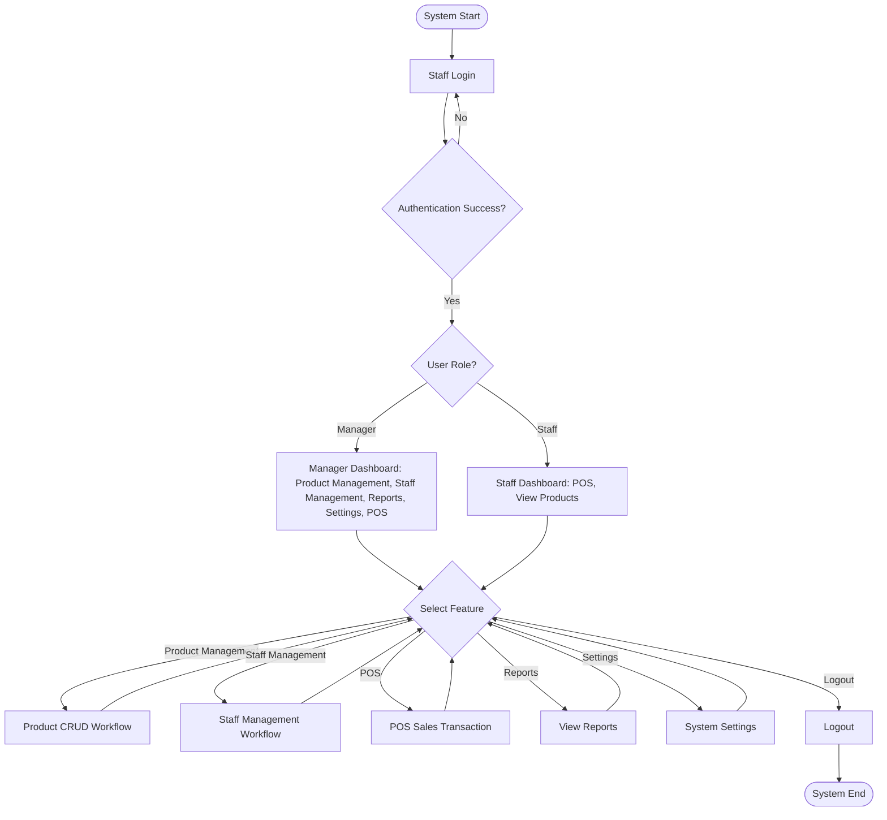

# POS System Workflow - Activity Diagrams

## 1. Staff Authentication & Authorization Workflow

## 2. Product CRUD Workflow

## 3. POS Sales Transaction Workflow

## 4. Expiry Data Management Workflow

## 5. Payment Processing Workflow

## 6. Staff Management Workflow

## 7. Complete POS System Main Workflow

